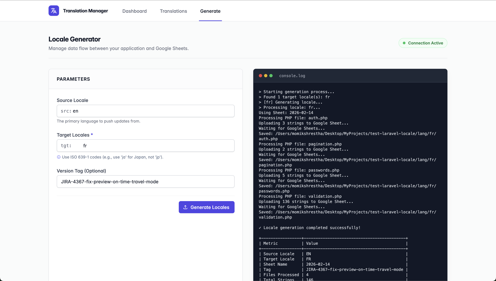

# Laravel Google Sheets Translator

**Manage your Laravel application translations effortlessly using Google Sheets.**

Say goodbye to manual JSON editing. Generate and update your language files via Google Sheets, use powerful formulas like `=GOOGLETRANSLATE()`, and pull them back into your app instantly.

[View Documentation](https://pg-momik.github.io/laravel-google-sheet-i18n/)




## Features
- **Smart Generation**: Push local keys to Sheets, generate translations, and pull them back.
- **Auto-Translate**: Leverage Google Sheets formulas for instant draft translations.
- **Smart Update**: Only new keys are added; existing translations are preserved.
- **Formula Support**: Preserves your custom formulas and row formatting.
- **Team Collaboration**: Share the Sheet link with translators. No Git access needed.
- **Visual Dashboard**: Premium UI to generate locales and track progress in real-time.

## Requirements
- **PHP**: ^8.0
- **Laravel**: ^8.0 | ^9.0 | ^10.0 | ^11.0 | ^12.0

## Installation

```bash
composer require momik/laravel-google-sheet-i18n
```

Run the interactive installer:
```bash
php artisan google-sheet-i18n:install
```

## Google Setup (The "Google Thingy")

To use this package, you need a Google Service Account.

1.  **Create Project**: Go to [Google Cloud Console](https://console.cloud.google.com/) and create a project.
2.  **Enable API**: Enable "Google Sheets API".
3.  **Service Account**: Create a Service Account (APIs & Services > Credentials).
4.  **Key**: Create a JSON key for the Service Account and download it to your project (e.g., `storage/app/google-service-account.json`).
5.  **Share**: Open your Google Sheet and **Share** it with the `client_email` from your JSON file (Editor access).

*See full guide in [docs/google-setup.md](docs/google-setup.md)*.

## Configuration (.env)

```env
GOOGLE_SHEET_I18N_ID=your_spreadsheet_id_from_url
GOOGLE_APPLICATION_CREDENTIALS=storage/app/google-service-account.json
```

## Usage

### Via CLI

Generate specific locales (e.g., Spanish, French):
```bash
php artisan translate:sheet es,fr
```

### Via Browser

Visit `/translation-manager` to access the visual generation dashboard.

## Documentation

Full documentation is available in the [`docs/`](docs/) directory.

## License
MIT
