# Setting up Google Sheets API

To use this package, you need a Google Cloud Project with the Sheets API enabled and a Service Account.

## 1. Create a Google Cloud Project
1. Go to the [Google Cloud Console](https://console.cloud.google.com/).
   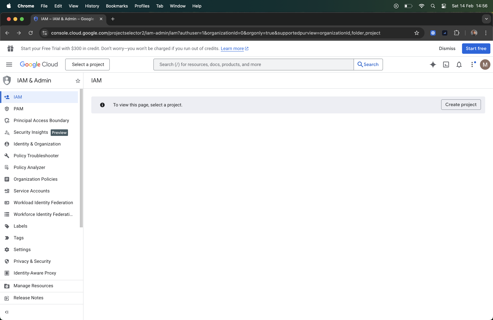
2. Create a new project (e.g., `laravel-i18n`).
   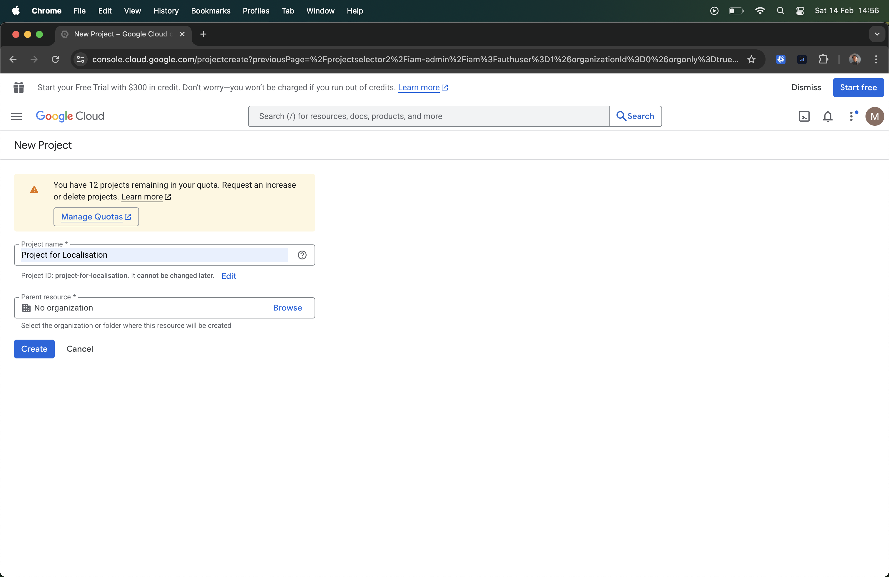

## 2. Enable Google Sheets API
1. In the sidebar, go to **APIs & Services > Library**.
   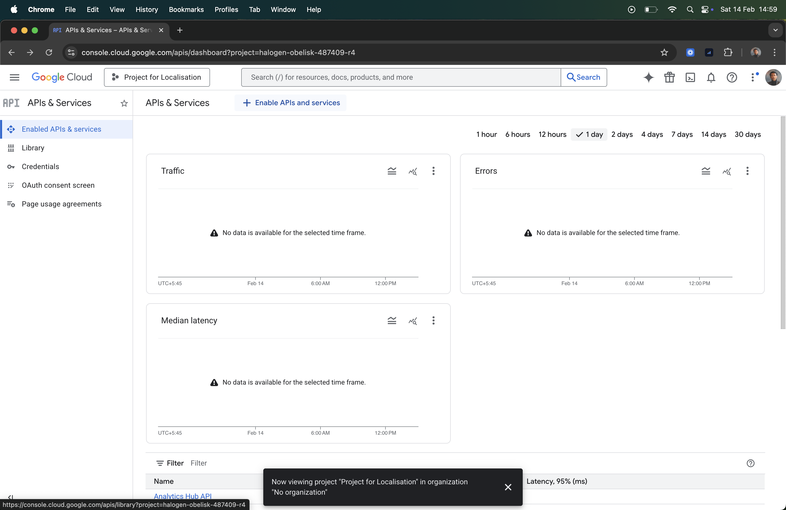
2. Search for **"Google Sheets API"**.
   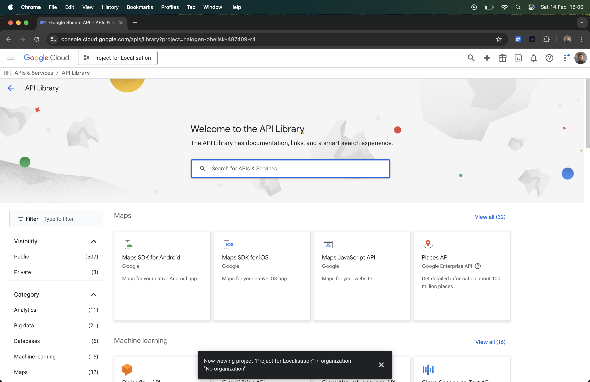
3. Click **Enable**.
   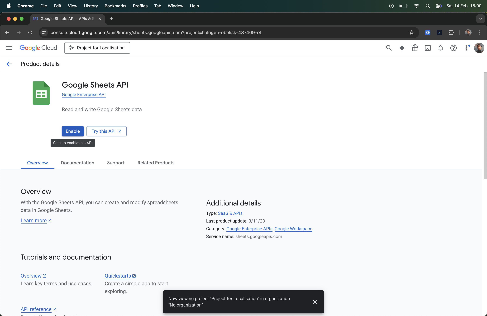

## 3. Create a Service Account
1. Go to **APIs & Services > Credentials**.
   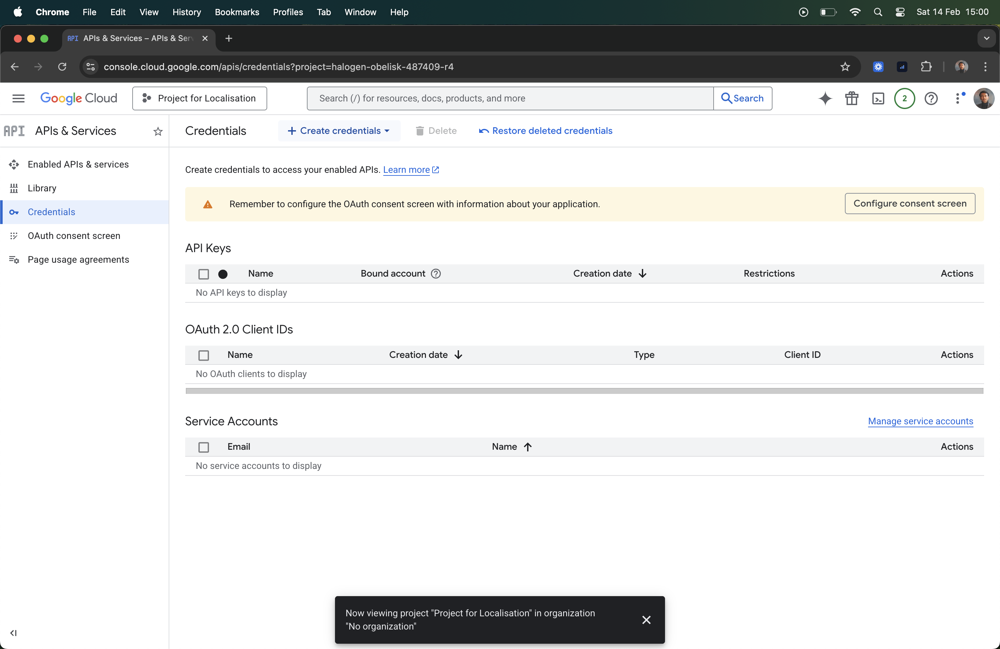
2. Click **Create Credentials > Service Account**.
   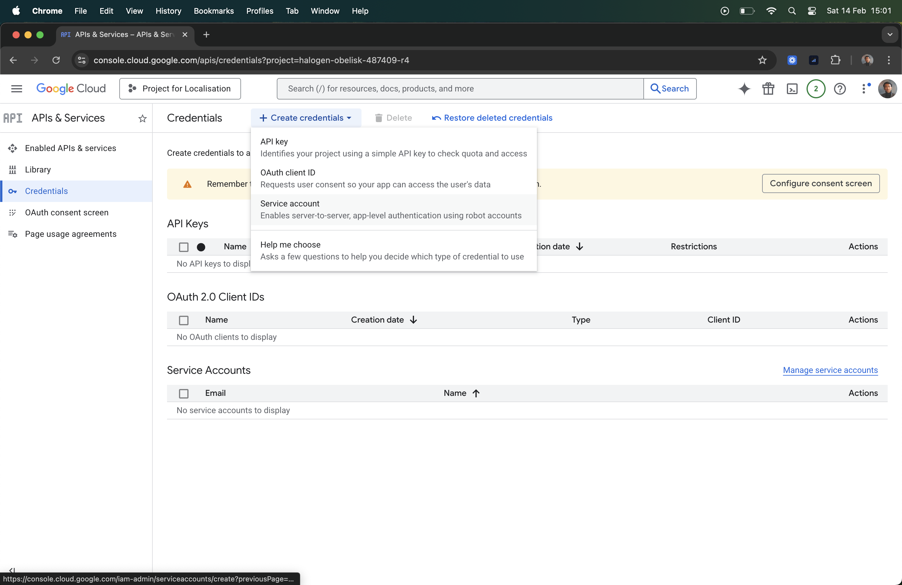
3. Name it (e.g., `laravel-translator`) and click **Create**.
   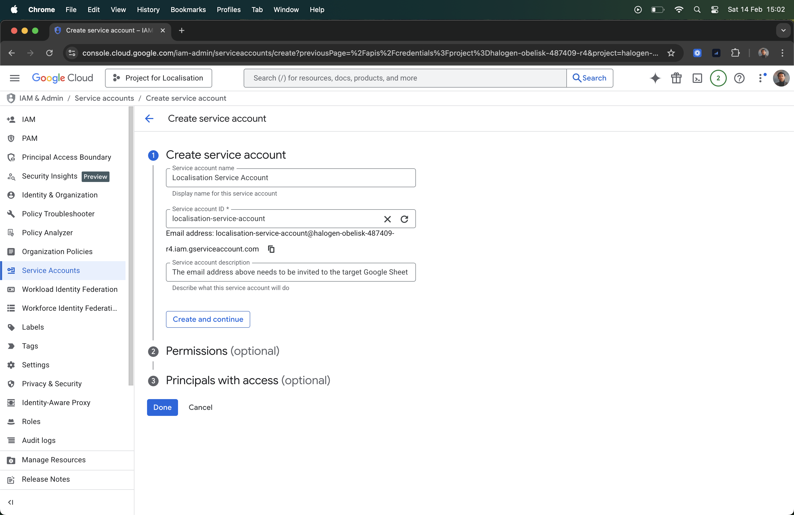

## 4. Download Service Account Key
1. Find your new Service Account in the list and copy its email address (you'll need this later). Then **click on the email** to open details.
   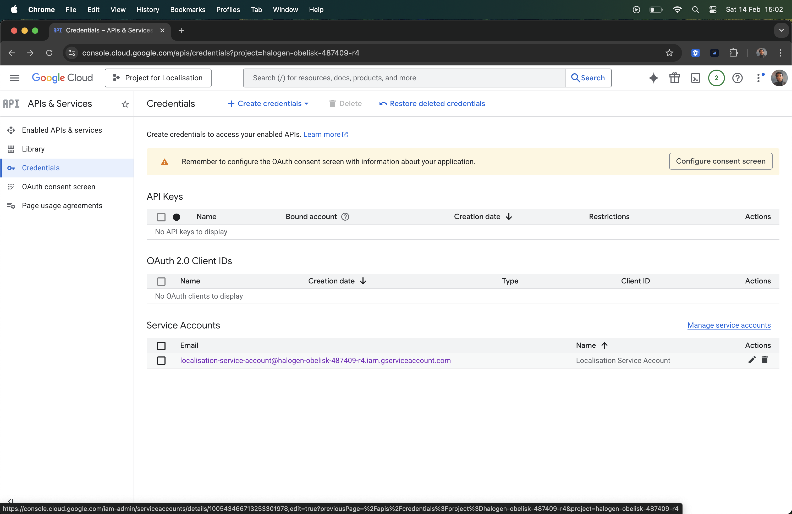
   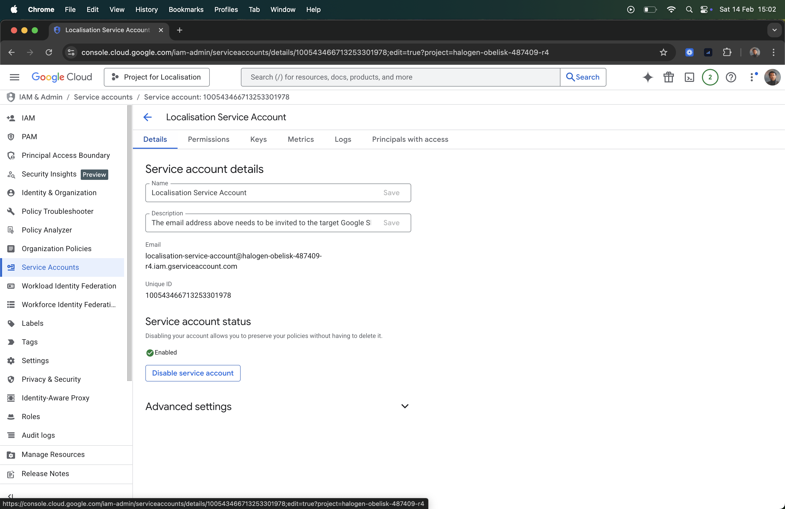
2. Go to the **Keys** tab.
   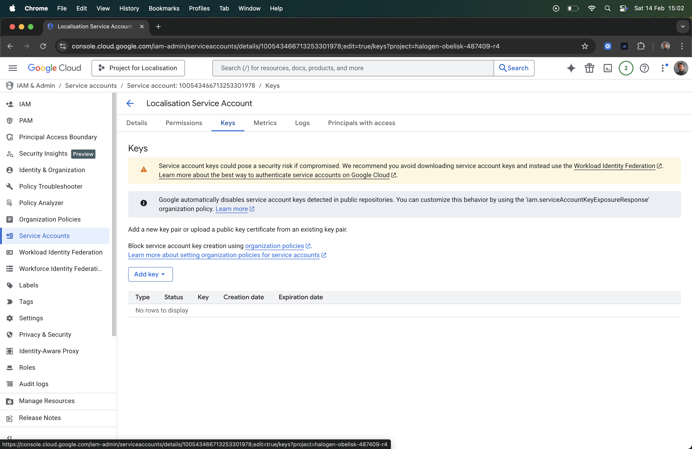
3. Click **Add Key > Create new key**.
   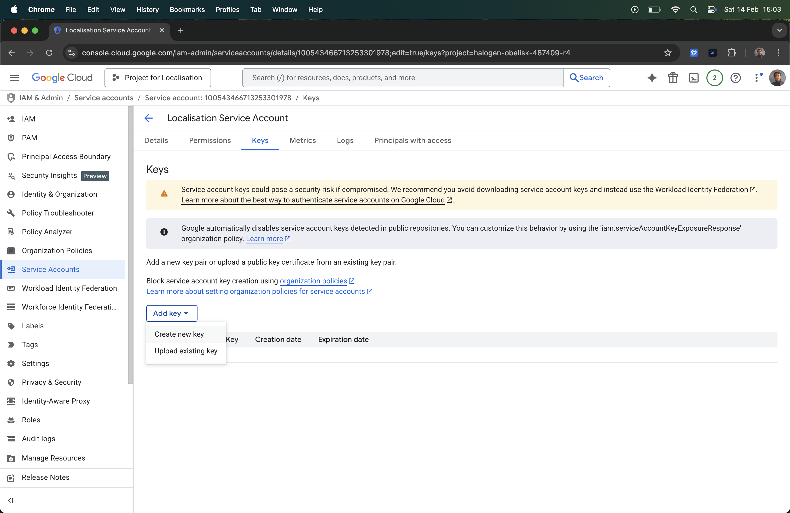
4. Select **JSON** and click **Create**. A file will download.
   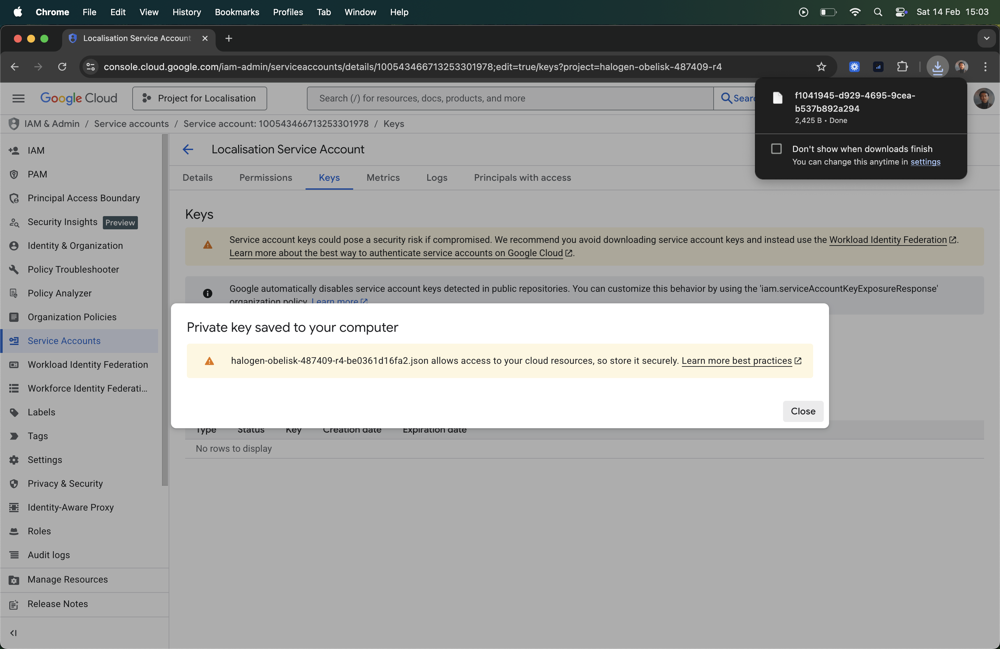

## 5. Share Your Google Sheet
1. Create a new Google Sheet.
   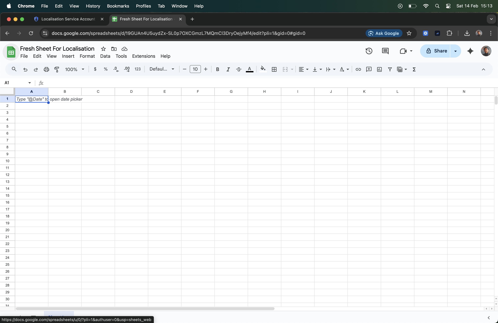
2. Click **Share** and add the **Service Account Email** you copied earlier as an **Editor**.
   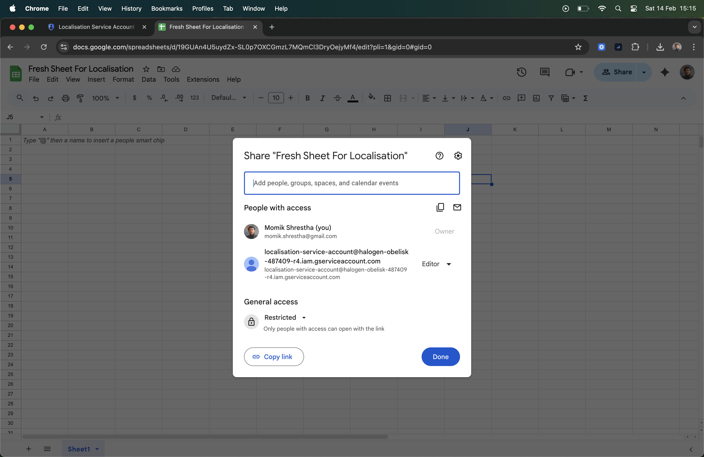

## 6. Configure Laravel
1. Put the downloaded JSON file in your project (e.g., `storage/app/google-service-account.json`).
2. Get your **Spreadsheet ID** from the URL.
   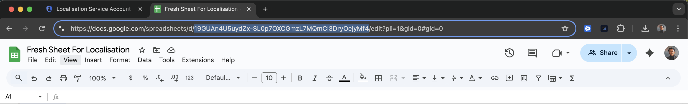
3. Update your `.env` file:
   ```env
   GOOGLE_SHEET_I18N_ID=your_spreadsheet_id
   GOOGLE_APPLICATION_CREDENTIALS=storage/app/google-service-account.json
   ```

